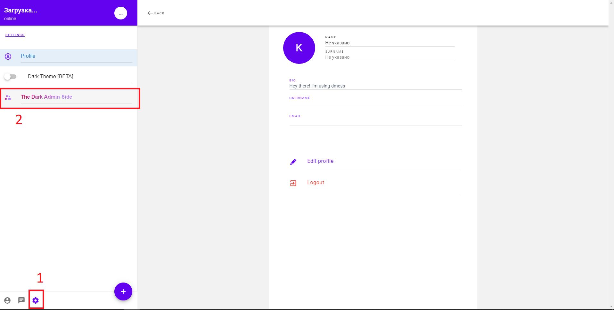
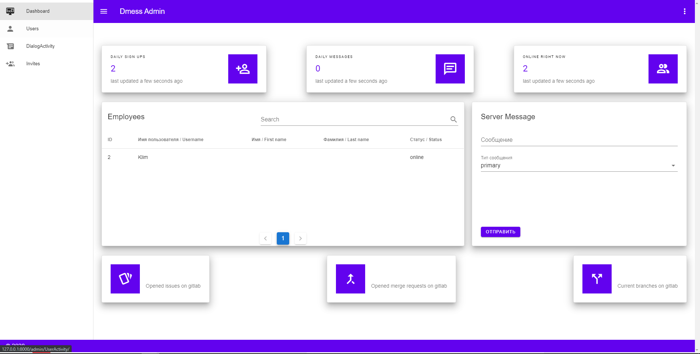
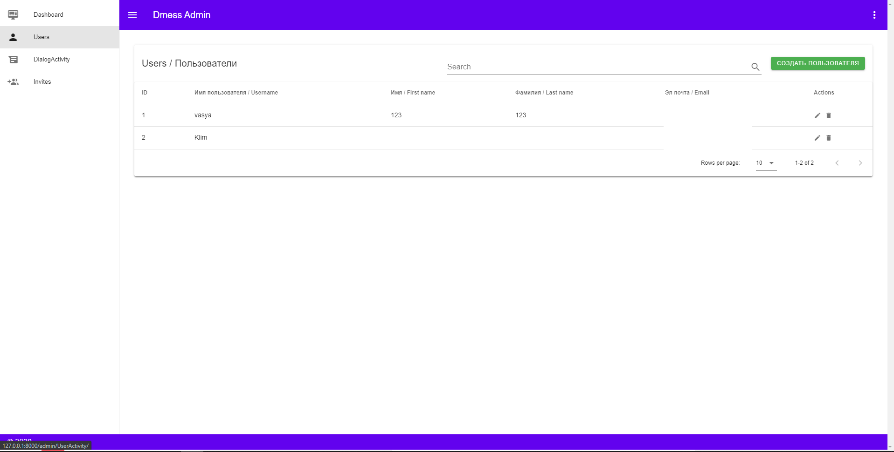
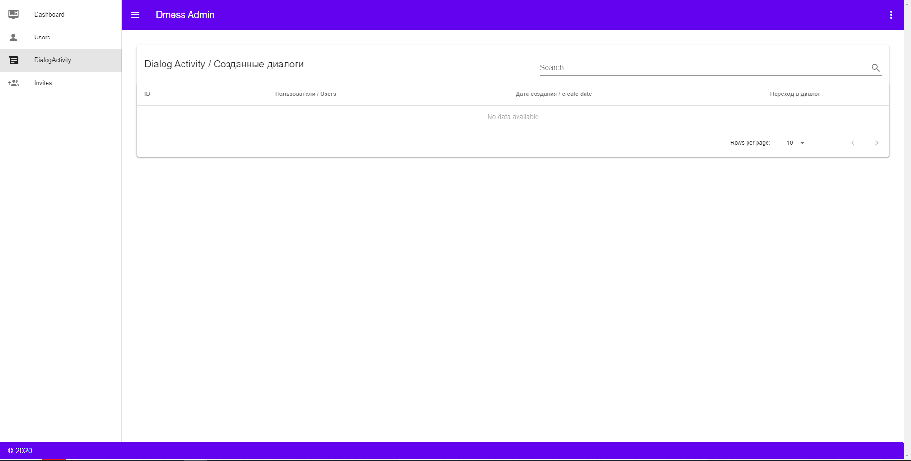
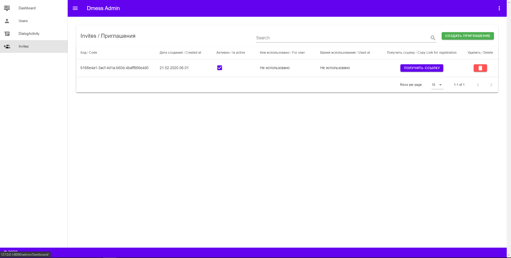

Документация для администратора
===============================

В этой документации подробно описаны принципы управления аккаунтом с правами администратора

.. contents:: Содержание
   :depth: 3

Вход в панель администратора
----------------------------

Для входа в панель администратора необходимо авторизоваться аккаунтомс повышенными правами.
После этого во вкладке настроек нажать на кнопку "The Dark Admin Dide".

Взаимодействие с панелью
------------------------

Меню Dashboard
~~~~~~~~~~~~~~

Данное меню позволяет отслеживать активность пользователей и разработчиков,
просматривать список сотрудников а так же создавать сообщение на сервере.

Меню Users
~~~~~~~~~~

Users - раздел панели администратора, позволяющий просматривать список всех пользователей и создавать их при необходимости.

Для создания пользователя нужно:

* Нажать на кнопку "Создать пользователя"
* Указать данные в нужные поля

Меню DialogActivity
~~~~~~~~~~~~~~~~~~~

DialogActivity - меню, показывающее список всех диалогов.
Диалоги из списка можно просматривать.

Меню Invites
~~~~~~~~~~~~

Блок Invites отображает все созданные пользователями ссылки для приглашения своих друзей.
Генерируется код и ссылка, которую нужно отправить своему другу.

