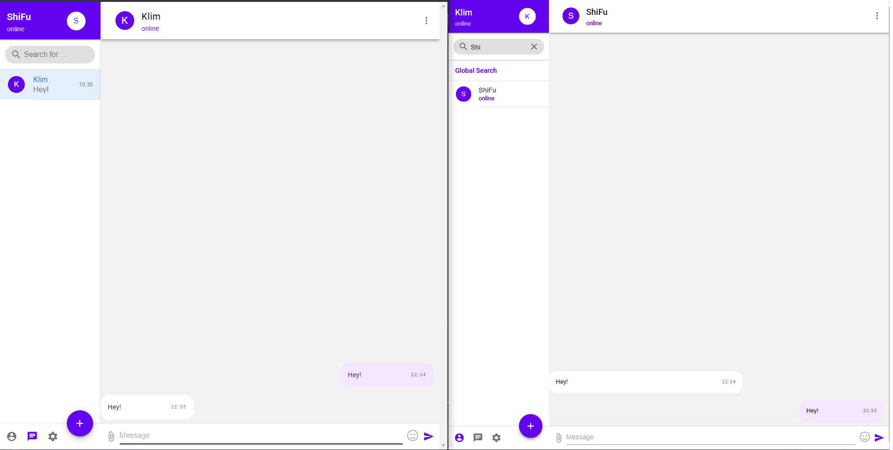
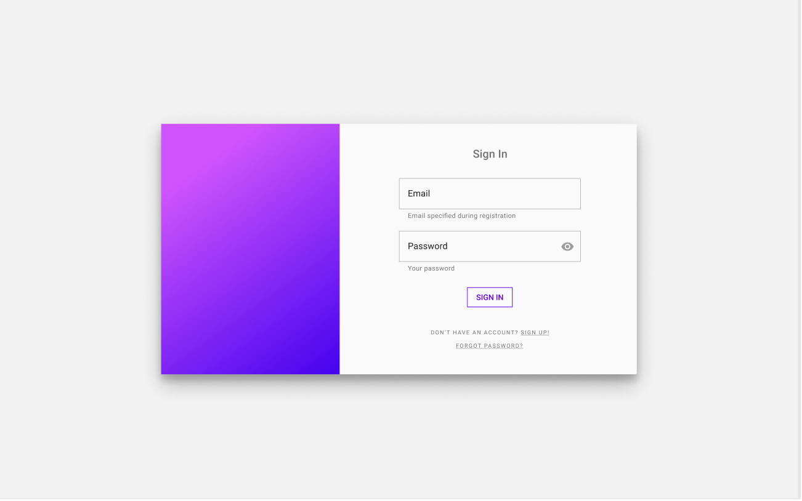
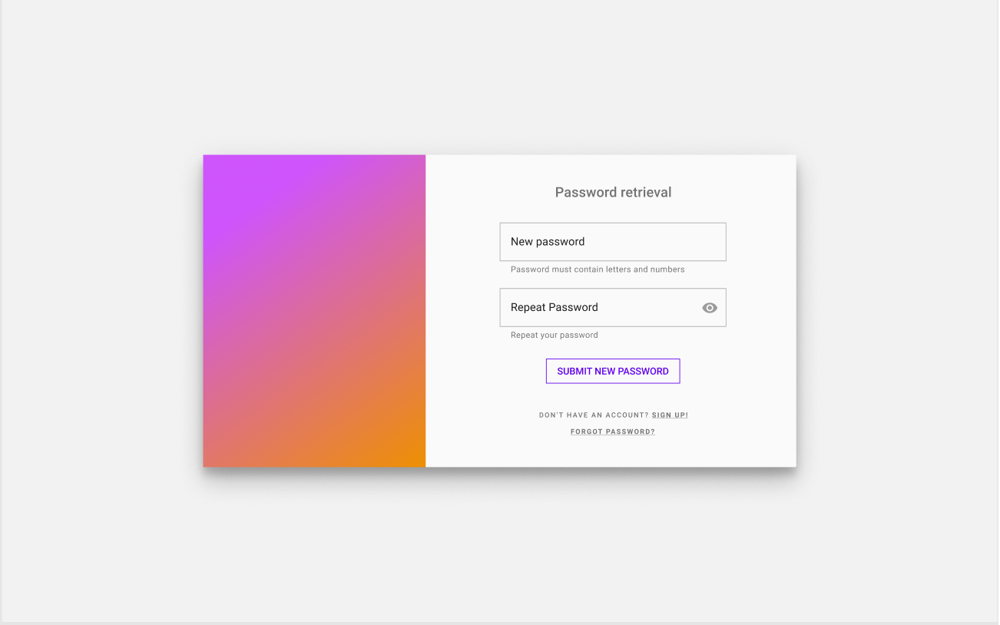
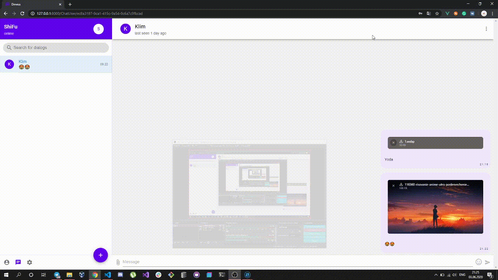
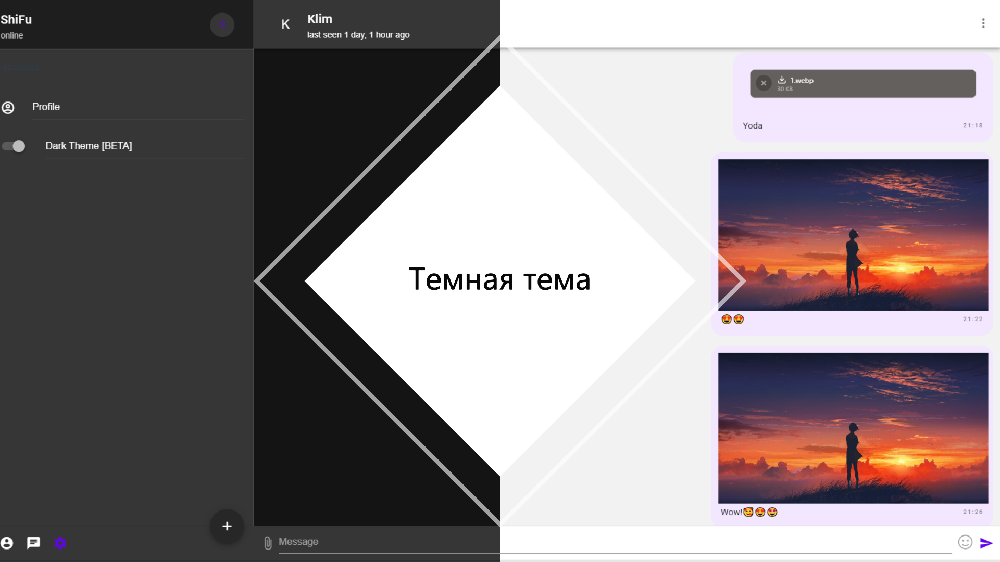

Документация пользователя
=========================

**Что такое Dmess?**
    Dmess - современный user-friendly мессенджер реального времени, позволяющий общаться с комфортом.

    Большая часть нашего api построена на технологии **WebSockets**, благодаря чему ваши данные и данные ваших друзей постоянно обновляются.
    Мы стараемся предоставить наиболее удобный способ взаимодействия.

В этой документации подробно описано, как пользоваться мессенджером.

.. contents:: Содержание
   :depth: 3

Создание аккаунта
-----------------
Для того чтобы пользоваться мессенджером, необходимо зарегистрировать аккаунт.
Это делается на странице `регистрации <https://d-messenger.ml/auth/register/>`_. Всё, что нужно для создания аккаунта - указать ваши данные.

* Ваша почта (Email)
* Ваш логин (Username)
* Ваше имя и фамилия (First name, Last name)
* Создание и повтор пароля (Password, Repeate Password)
    * Важно! **Нужно создавать надёжный пароль (Заглавные и строчные буквы, цифры).**
    * Важно! **После регистрации вам придет письмо на почту, в котором находится ссылка для подтверждения вашей регистрации.**

.. image:: _static/Регистрация.png
    :align: center

Как войти в мессенджер
----------------------

Для авторизации на сайте нужно перейти на страницу `входа <https://d-messenger.ml/auth/login/>`_. В форме авторизации, в появившихся полях, нужно ввести свой логин и пароль, указанные при регистрации.

.. image:: _static/Логин.png
    :align: center

Восстановление пароля
~~~~~~~~~~~~~~~~~~~~~
Если вы забыли пароль от своего аккаунта, нажмите на кнопу "Forgot Password".
- Напишите ваш логин
- На указанную при регистрации почту придет письмо с ссылкой для восстановления пароля
- Придумайте новый пароль

Редактирование пользователя
---------------------------
Редактирование профиля происходит во вкладке профиля

* В правом верхнем углу нажать на кнопку **Profile**
* В новой вкладке нажать кнопку **Edit profile**
* Теперь появилась возможность изменять статус и др.

Добавить в контакты
-------------------

Для добавения пользователя в контакты необходимо:
1. Перейти на вкладку *contacts* в боковой панели
2. Найти пользователя через строку поиска и кликнуть на нужного
3. Вы перешли в его профиль. Теперь нажмите на кнопку "Add to contact list"
4. Если вдруг передумали, после добавления кнопка поменятеся на *Remove from contact list*.Нажмите на нее для удаления контакта из своего списка.

.. image:: _static/Контакт.png
    :align: center

Отправка сообщений
------------------
Поиск пользователя и начало общения
~~~~~~~~~~~~~~~~~~~~~~~~~~~~~~~~~~~~~~~~

Чтобы найти пользователя, введите его логин(**username**) в поле поиска пользователей.
Появится окно его профиля. Для начала общения нажмите кнопку "start messaging", после чего появится окно диалога с пользователем

.. image:: _static/Поиск.png
    :align: center

.. image:: _static/Профиль.png
    :align: center

Отправка сообщений
~~~~~~~~~~~~~~~~~~
Для общение с пользователем, необходимо:
* Перейти во вкладку сообщений
* Выбрать нужного пользователя
* В поле ввода написать нужное вам сообщение и отправить

.. image:: _static/Сообщение_1.png
   :align: center
   
.. image:: _static/Сообщение_2.png
   :align: center

Отправка файлов в сообщениях
~~~~~~~~~~~~~~~~~~~~~~~~~~~~

Для отправки файлов необходимо нажать на специальную кнопку, по активации которой всплывает окно для добавления файла.
Загрузить файл можно двумя способами:
- Drag-and-drop(перетащить нужный файл в окно браузера)
- Через меню взаимодействия с файлами.

Отправка смайликов(эмодзи)
~~~~~~~~~~~~~~~~~~~~~~~~~~

Отправить эмодзи можно благодаря специальной кнопки рядом с полем сообщения.

Темная тема
-----------
Для переключения темы перейдите в настройки, затем нажмите на кнопку "Dark Theme"

