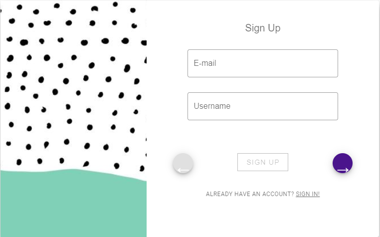
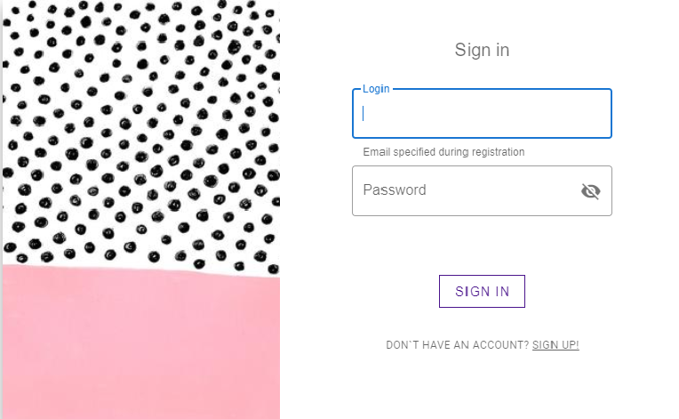
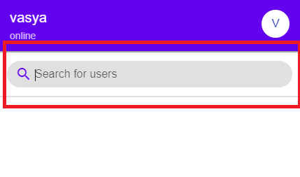
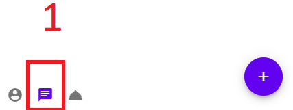
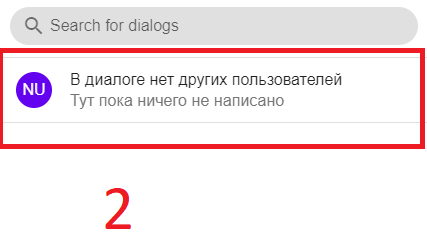

Документация пользователя
=========================

**Что такое Dmess?**

    Dmess - простой мессенджер, позволяющий легко общаться с твоими друзьями и выполнять проекты.

В этой документации подробно описано, как пользоваться мессенджером, как создать аккаунт.

.. contents:: Содержание
   :depth: 3

Создание аккаунта
-----------------
Для того чтобы пользоваться мессенджером, необходимо зарегестрировать аккаунт.
Это делается на странице `регистрации <https://d-messenger.ml/auth/register/>`_. Всё, что нужно для создания аккаунта - указать ваши данные.

* Ваша почта(Email)
* Ваш ник(Username)
* Ваше имя и фамилия(First name, Last name)
* Создание и повтор пароля(Password, Repeate Password)
    * Важно! **Нужно создавать надёжный пароль(Заглавные и строчные буквы, цифры)**

Как войти в мессенджер
----------------------

Для авторизации на сайте нужно перейти на сайт `входа <https://d-messenger.ml/auth/login/>`_. В форме авторизации, в появившихся полях, нужно ввести свой никнейм и пароль, указанные при регистрации.

Редактирование пользователя
---------------------------
Редактирование профиля происходит во вкладке профиля

* В правом верхнем углу нажать на кнопку **Profile**
* В новой вкладке нажать кнопку **Edit profile**
* Теперь появилась возможность изменять статус и др.

Отправка сообщений
------------------
Нахождение пользователя
~~~~~~~~~~~~~~~~~~~~~~~
Чтобы найти пользователя, введите его ник(**username**) в поле поиска пользователей.

Отправка сообщений
~~~~~~~~~~~~~~~~~~
Для общение с пользователем, необходимо:
* Перейти во вкладку сообщений
* Выбрать нужного пользователя
* В поле ввода написать нужное вам сообщение и отправить

   

